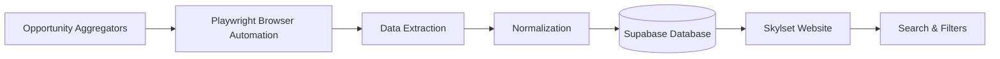

# Skylset

Skylset is a web platform that helps high school students discover and compare internships, scholarships, research opportunities, clubs, and academic programs.

**Live Application:** [https://aravmehta20.github.io/skylset/webpages/index.html](https://aravmehta20.github.io/skylset/webpages/index.html)


---

## Overview

Finding meaningful opportunities often requires searching across dozens of unrelated websites with inconsistent information. Skylset centralizes these opportunities into a searchable database with structured metadata, filtering, and a transparent competitiveness index.

---

## Current Features

- Search opportunities by keyword
- Filter by opportunity type, interest area, grade, location, cost, and deadline
- Browse internships, scholarships, research programs, clubs, and academic programs
- View structured opportunity information
- Compare opportunities using SkylScore
- Responsive desktop and mobile interface

---

## Technology

- HTML
- CSS
- JavaScript
- Supabase
- Playwright
- Python
- GitHub Pages

---

## System Architecture



For additional details, see the
[Architecture Documentation](docs/architecture.md).

---

## Data Pipeline

```text
Opportunity Aggregators
        ↓
Playwright Browser Automation
        ↓
Field Extraction
        ↓
Normalization
        ↓
Manual Review
        ↓
Supabase Database
        ↓
Skylset Website
```

The complete collection workflow is documented in the
[Data Pipeline Documentation](docs/data-pipeline.md).

---

## Opportunity Data

Each opportunity may contain:

- Name
- Opportunity Type
- Description
- Deadline
- Location
- Area of Interest
- Eligibility
- Cost
- Official Website
- SkylScore

When information cannot be verified, it is stored as `null` rather than being estimated.

---

## SkylScore

SkylScore is a transparent **1–10 competitiveness index** designed to help students compare opportunities.

It considers factors such as:

- Acceptance rate
- Applicant pool size
- Institutional reputation
- Scholarship value or program cost
- Application complexity

SkylScore is intended only as a comparison tool—it is **not** an admissions prediction or guarantee.

The complete methodology is available in the
[SkylScore Documentation](docs/skylscore.md).

---

## Repository Structure

```text
assets/
docs/
scripts/
styles/
webpages/
webscraper/
```

---

## Running Locally

Clone the repository:

```bash
git clone https://github.com/aravmehta20/skylset.git
cd skylset
```

Start a local server:

```bash
python3 -m http.server 8000
```

Then open:

```text
http://localhost:8000/webpages/index.html
```

---

## Limitations

- Opportunity information may become outdated after collection.
- Aggregator websites occasionally provide incomplete information.
- Official program websites should always be considered the authoritative source.
- Automated scraping still requires manual review before publication.
- Some organizations do not publish enough information for a complete SkylScore.

---

## Project Status

The current public release includes:

- Opportunity database
- Playwright data collection pipeline
- Supabase backend
- Search
- Multi-criteria filtering
- SkylScore competitiveness index
- Responsive web interface

Authentication, personalized recommendations, saved opportunities, and the opportunity quiz are not included in the current public release.

---

## Documentation

- [Architecture](docs/architecture.md)
- [Data Pipeline](docs/data-pipeline.md)
- [SkylScore Methodology](docs/skylscore.md)

---

## Author

Created by **Arav Mehta**.

Incoming Biomedical Engineering student at **The University of Texas at Austin** with interests in biomedical devices, embedded systems, human-computer interaction, and data-driven engineering.
