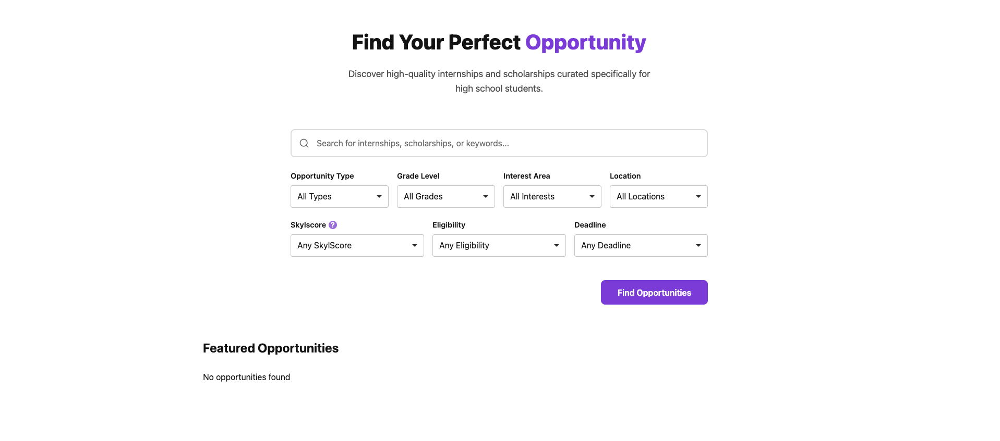
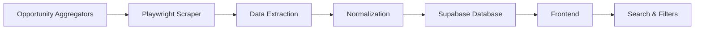

# Skylset

Skylset is a web platform that helps high school students discover and compare internships, scholarships, research opportunities, clubs, and academic programs.

🌐 **Live Application:** https://aravmehta20.github.io/skylset/webpages/index.html



---

## Overview

Finding meaningful opportunities often requires searching across dozens of unrelated websites with inconsistent information. Skylset centralizes these opportunities into a searchable database with structured metadata, filtering, and a transparent competitiveness index.

---

## Current Features

- Keyword search
- Multi-criteria filtering
- Structured opportunity database
- SkylScore competitiveness index
- Responsive desktop and mobile interface

---

## Technology

- HTML
- CSS
- JavaScript
- Supabase
- Playwright
- Python
- GitHub Pages

---

## System Architecture



See **docs/architecture.md** for more information.

---

## Data Pipeline

```text
Opportunity Aggregators
↓
Playwright Browser Automation
↓
Field Extraction
↓
Normalization
↓
Manual Review
↓
Supabase
↓
Skylset Website
```

---

## Opportunity Data

Each opportunity may contain

- Name
- Type
- Description
- Deadline
- Location
- Area of Interest
- Eligibility
- Cost
- Official Link
- SkylScore

Unknown information is stored as **null** rather than guessed.

---

## SkylScore

SkylScore is a transparent 1–10 competitiveness index.

Factors include

- Acceptance rate
- Applicant pool
- Institutional reputation
- Scholarship value or program cost
- Application complexity

It is intended only as a comparison tool—not an admissions prediction.

---

## Repository Structure

```text
assets/
docs/
scripts/
styles/
webpages/
webscraper/
```

---

## Running Locally

```bash
git clone https://github.com/aravmehta20/skylset.git
cd skylset
python3 -m http.server 8000
```

Open

```
http://localhost:8000/webpages/index.html
```

---

## Limitations

- Opportunity information may become outdated
- Official websites should always be consulted
- Aggregator websites sometimes omit information
- Automated scraping still requires manual review

---

## Project Status

Current public release includes

- Search
- Filtering
- Opportunity database
- Playwright scraping pipeline
- SkylScore

Authentication, personalization, and favorites are not included in this public release.

---

## Author

Arav Mehta
