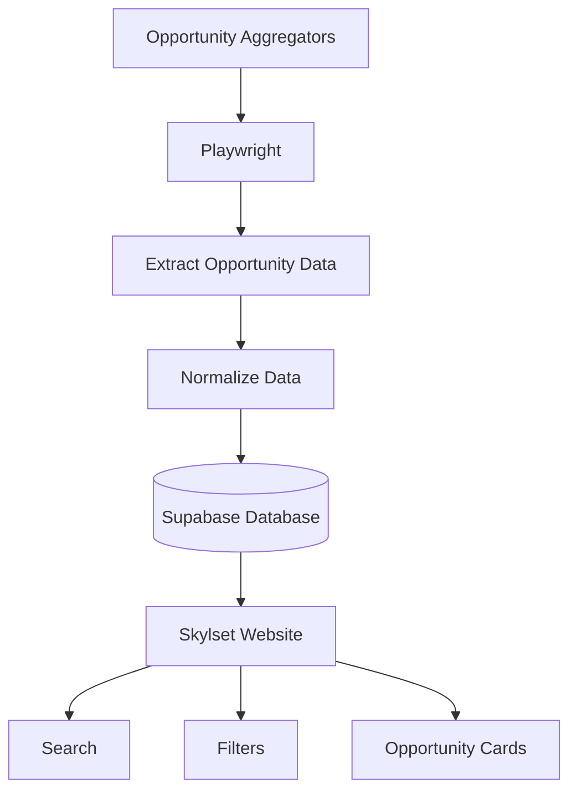

# Skylset Architecture

## Overview

Skylset consists of two primary systems:

1. A Playwright-based data collection pipeline
2. A Supabase-backed web application

## Data Collection

Playwright automates browser navigation across opportunity aggregation websites.

The collected information is normalized into a consistent schema before being reviewed and uploaded into Supabase.

## Frontend

The frontend is responsible for:

- Searching opportunities
- Filtering opportunities
- Displaying opportunity cards
- Responsive layouts

## Backend

Supabase stores structured opportunity records and serves filtered queries to the frontend.

## Deployment

The application is deployed through GitHub Pages and available at https://skylset.com.
